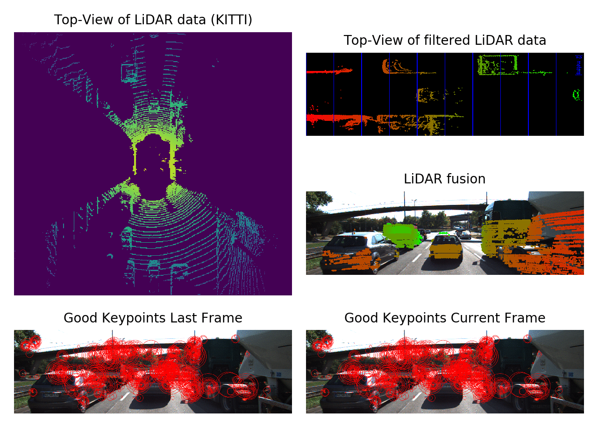

## LiDAR and Camera Fusion for Estimating Time-to-Collision

## Description

This repository contains starter code for the 3D Object Tracking project as part of Udacity Sensor Fusion Nanodegree.
The goal is to compute time to collision by fusing 3D position infromation obtained from LiDAR point cloud with object detection using camera images.
The starter code in the nanodegree is gradually developed in C++ in 7 steps as part of the lectures. I reimplemented the 7 steps in python to quickly prototype algorithms and play around with different ideas before implementing the C++ solution. I hope this would be useful for others as well. For YOLO V3, I incorporated both OpenCV dnn library and keras model. In the final code, I use OpenCV version since it is much faster. I also incorporated some plotting functions from Kitti python code base that crop Lidar data using field of view and visualize top-view. You can download the data from [1].

 

## Code Structure 

**/scripts/SensorProcessor.py :**

- CameraProcessing class implements all image processing methods
	- computeFeatureDescriptors: given two consecutive frames, computes FAST keypoint detector and BRIEF descriptors for each frame (Step 5-6)
	- matchFeatureDescriptor: computes good descriptor matches based on distance ratio test (Step 7)
- LidarProcessing class implements all LiDAR processing methods
	- projectLidarToCam: projects 3D lidar points to camera image and returns 2D lidar coordinates in camera space 
	- velo_points_filter_kitti:crops lidar points based on [2] vertical and horizontal field of view  (pitch, yaw). (Step 3)
	- crop_lidar_points: crops lidar points based on a given 3D position range and reflectivity. (Step 3)
	- cluster_lidar_with_ROI: given anchor box coordinates from YOLO, clusters the lidar points within the bounding boxes and removes overlaps (Step 4)

**/scripts/YOLO.py :**

- ObjectDetectionOpenCV class implements YOLO v3 using OpenCV dnn library [3]
	- predict: decodes YOLO network output to anchor box coordinates, labels and confidence scores and implements non-maximum suppression. (Step 2)
- ObjectDetection class implements YOLO v3 using Keras [4]
	- predict: decodes YOLO network output to anchor box coordinates, labels and confidence scores and implements non-maximum suppression. (Step 2)
- Helper functions from [4]  for ObjectDetection class

**/scripts/LidarCameraFusion.py** (Step 1)

**/scripts/LidarCameraFusion_animate.py :** generates the sensor fusion gif  above

**/scripts/Utils.py :**

- View class: helper class to plot results of each step
- Plot class: helper class for creating animation

## Dependencies

Tested on ubuntu 18.04 
* conda 4.8.3
* keras 2.3.1
* tensorflow 1.14.0
* recordtype 1.3
* opencv 4.3.0
* glob 

## References

Code references were cited in the scripts.

_[1]_ https://github.com/udacity/SFND_3D_Object_Tracking

_[2]_ https://github.com/windowsub0406/KITTI_Tutorial

_[3]_ https://www.pyimagesearch.com/2018/11/12/yolo-object-detection-with-opencv/

_[4]_ https://github.com/experiencor/keras-yolo3
